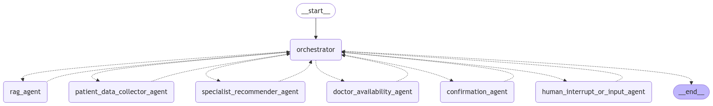

# AI-Powered Hospital Chatbot

An AI agent-based hospital chatbot designed to help users or patients book their appointments with the corresponding doctor and provide answers to general hospital-related queries.

## Table of Contents

1. [Description](#description)
2. [Technologies Used](#technologies-used)
3. [Installation and Setup](#installation-and-setup)
4. [Usage](#usage)
5. [Agents](#agents)

## Description

This chatbot leverages advanced AI frameworks and platforms to facilitate seamless appointment booking and provide informative responses to patients inquiries. The application is designed to enhance the efficiency of hospital operations and improve patient experience.



## Technologies Used

- **AI Frameworks**: Langgraph, Langchain, Llama-Index
- **AI Platform**: 
  - Groq Cloud (for utilizing LLMs)
  - HuggingFace (for Embedding Models)
- **Large Language Model (LLM)**: deepseek-r1-distill-llama-70b
- **Embedding Model**: all-MiniLM-L6-v2 from sentence-transformers
- **Vector Store**: FAISS
- **Database**: PostgreSQL

## Installation and Setup

Ensure you have Python version 3.11 or higher.

1. Clone the repository and navigate to the project directory.
2. Install the required packages:

   ```bash
   pip install -r requirements.txt
   ```

All the necessary files to create the chatbot are located inside the `src` folder. This folder also includes resources for Retrieval-Augmented Generation (RAG), using general documents from NABH to assist in answering queries.

## Usage

To run the chatbot, execute the following command in your terminal:

```bash
python src/main.py
```

## Agents  

This system consists of multiple AI agents working collaboratively to facilitate hospital appointment booking and user queries. Each agent has a specific role in ensuring a seamless user experience.  

### 1. **Orchestrator Agent**  
   - Manages interactions between different agents.  
   - Ensures a structured and focused conversation with the user.  
   - Oversees appointment booking and query resolution.  

### 2. **RAG Agent**  
   - Retrieves and provides relevant context based on the user’s query.  
   - Enhances responses by pulling information from vector databases.  

### 3. **Patient Data Collector Agent**  
   - Gathers essential patient details.  
   - Stores patient data securely in the database.  

### 4. **Specialist Recommender Agent**  
   - Identifies the user’s preferred doctor specialization.  
   - Suggests a list of relevant doctors.  

### 5. **Doctor Availability Agent**  
   - Retrieves available time slots for a selected doctor.  
   - Ensures up-to-date scheduling information.  

### 6. **Confirmation Agent**  
   - Finalizes appointment booking.  
   - Provides confirmation details to the user.  

### 7. **Human Interrupt Agent**  
   - Redirects conversations to the user when manual input is required.  
   - Ensures smooth processing when automated responses are insufficient.  